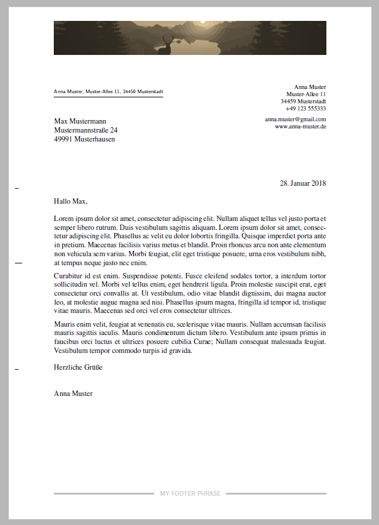

# Letter Template

Features:
 - build from Markdown
 - aligned header, footer and location with text body
 - footer with filling hlines
 - custom header (with image for example)

## Screenshot

## Credits

Header image from [http://hdwallpaperfx.com/minimal-sunset-forest-wallpaper/](http://hdwallpaperfx.com/minimal-sunset-forest-wallpaper/).

LaTeX template based on Elmueller Formal Letter.

Markdown template originally based on [https://github.com/JensErat/pandoc-scrlttr2](https://github.com/JensErat/pandoc-scrlttr2).

